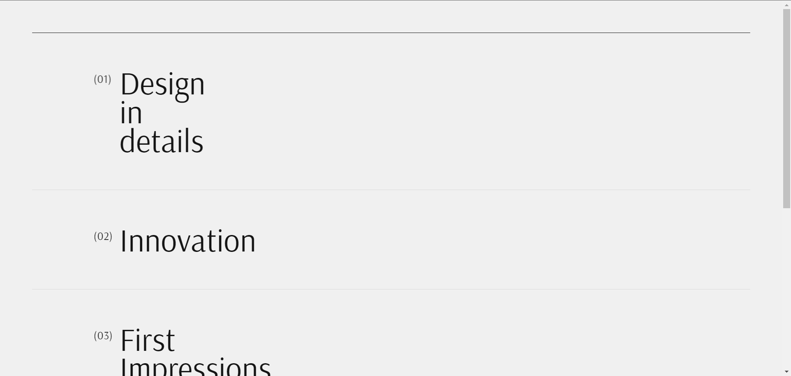
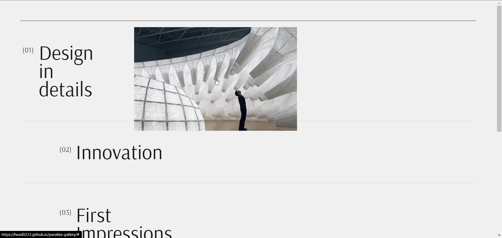
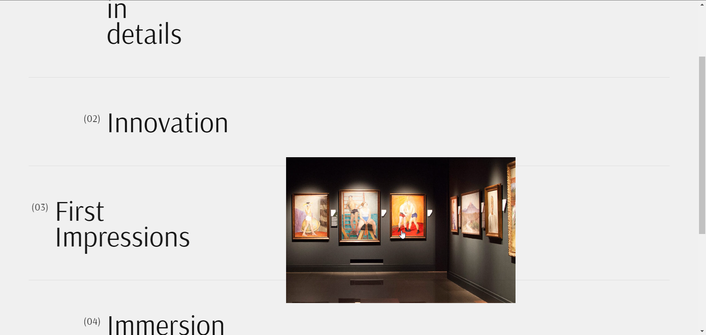

# Parallax Gallery Project

Explore the Parallax Gallery, a visually engaging website that showcases art images corresponding to elements in the list upon hovering. Immerse yourself in this interactive and captivating gallery experience.

## Table of Contents

-  [Folder Structure](#folder-structure)
-  [Usage](#usage)
-  [Media](#Media)
-  [Contributing](#contributing)

## Folder Structure

-  **css:** Contains the styles for the website.
-  **fonts:** Contains font files utilized in the project.
-  **img:** Holds all the images used in the project.
-  **js:** Includes the JavaScript file for additional functionality.

## Usage

1. Clone the repository:

```bash
git clone https://github.com/HEAD0223/parallax-gallery.git
cd parallax-gallery
```

2. Open the index.html file in a web browser to view the website.

## Media






## Contributing

If you would like to contribute to this project, please follow these steps:

1. Fork the repository.
2. Create a new branch for your feature: `git checkout -b feature-name`
3. Commit your changes: `git commit -m 'Add some feature'`
4. Push to the branch: `git push origin feature-name`
5. Submit a pull request.
